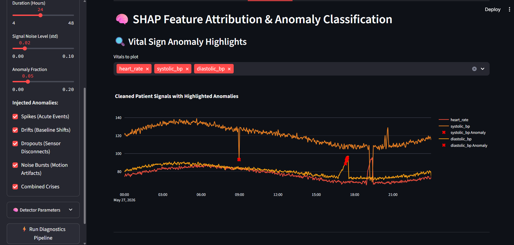
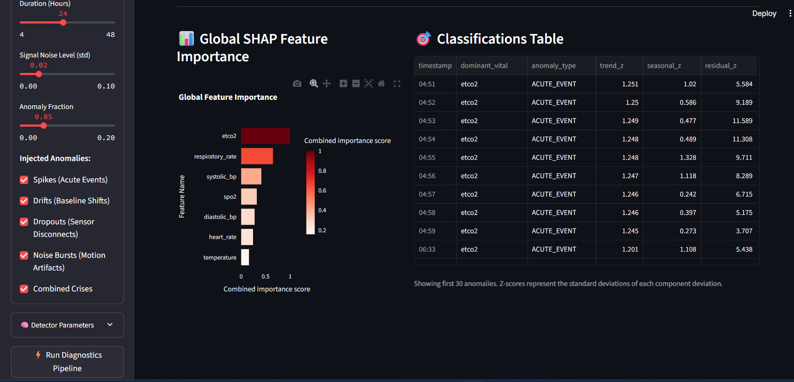
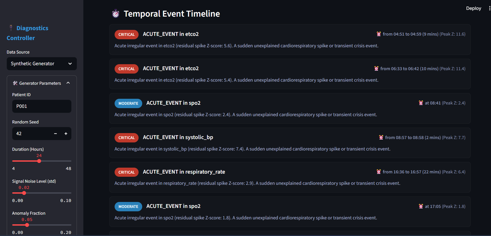
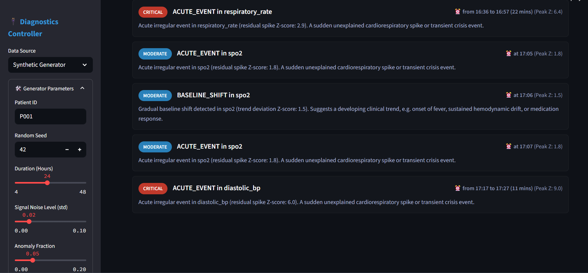
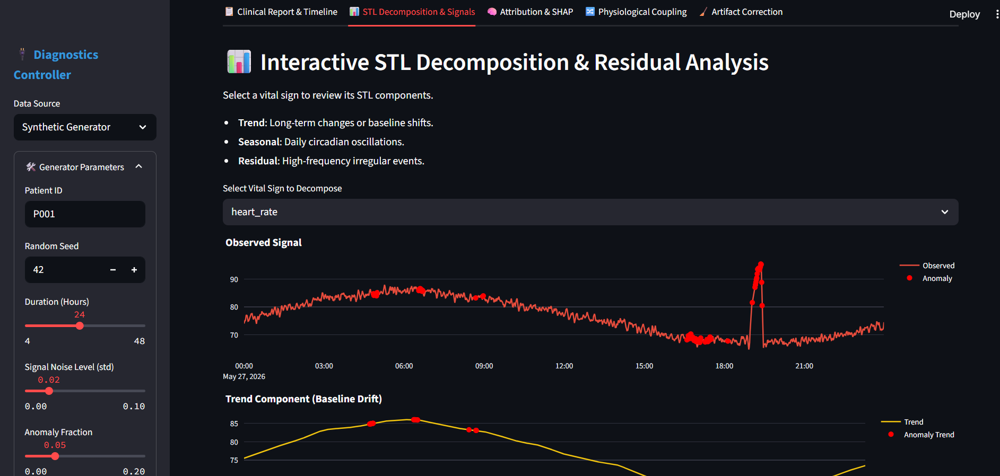
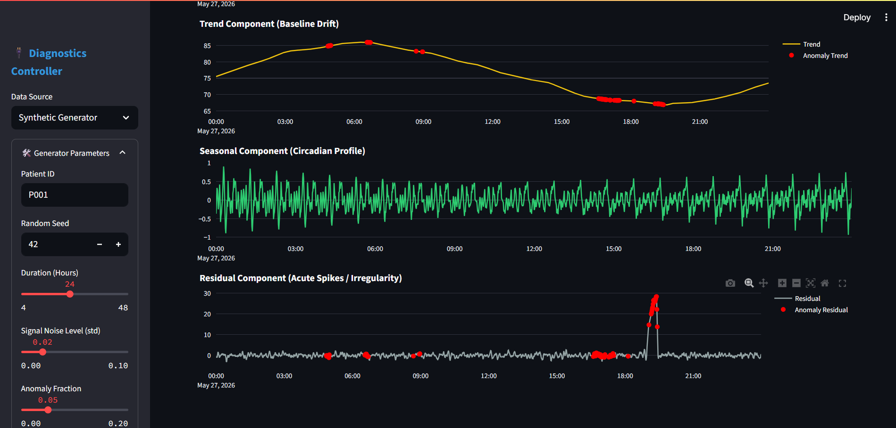

# 🏥 Interpretable Physiological Time-Series Anomaly Attribution 


## 🏥 PhysioAnomaly

**Interpretable anomaly detection + attribution for physiological monitoring** (ICU + remote vitals).


> **Problem**: Continuous vital-sign streams contain artifacts and clinically important events.  
> **Solution**: Detect anomalies *and* explain which signals drove them, then summarize findings in a clinician-friendly report/dashboard.

<!-- Optional badges (update links/License as needed) -->


## What this project does

- **Clean & normalize** multivariate vital signals (missing data, sensor disconnects, motion artifacts)
- **Decompose** signals (STL trend/seasonal/residual + wavelets)
- **Detect anomalies** (statistical + Isolation Forest + optional LSTM autoencoder)
- **Explain anomalies** with **SHAP-based attribution** (interpretable AI)
- **Analyze relationships** (correlation, lead–lag, Granger “predictive causality”)
- **Generate outputs**: plots + a plain-English clinical-style report + Streamlit dashboard

## 🏗️ Architecture

```
PhysioAnomalyPipeline/
├── data/              → Synthetic ICU data generation & loading
├── preprocessing/     → Signal cleaning, normalization, feature engineering
├── decomposition/     → STL + Wavelet signal decomposition
├── detection/         → Statistical, Isolation Forest, LSTM Autoencoder detectors
├── attribution/       → SHAP-based anomaly attribution & feature importance
├── relationships/     → Cross-correlation & Granger causality analysis
├── insights/          → Clinical interpretation & natural language explanations
├── visualization/     → Interactive matplotlib/plotly dashboards
├── pipeline/          → End-to-end orchestration
└── notebooks/         → Beginner-friendly Jupyter tutorial
```

## 🔄 Pipeline flow (high level)


flowchart LR
  A[Data: Synthetic or CSV] --> B[Cleaning & Imputation]
  B --> C[Normalization]
  C --> D[Feature Engineering]
  D --> E[STL Decomposition]
  E --> F[Residual-based Detection (Z/IQR)]
  D --> G[Isolation Forest Detection]
  D --> H[LSTM Autoencoder (optional)]
  F --> I[Ensemble Voting]
  G --> I
  H --> I
  I --> J[SHAP Attribution + Feature Importance]
  E --> K[Lead-Lag + Correlation]
  E --> L[Granger Predictive Relationships]
  J --> M[Clinical Interpreter]
  K --> M
  L --> M
  M --> N[Report + Plots + Dashboard]
```

## 🩺 Vital Signs Monitored

| Signal | Normal Range | Clinical Significance |
|--------|-------------|----------------------|
| Heart Rate (HR) | 60–100 bpm | Cardiac function |
| Systolic BP | 90–140 mmHg | Circulatory pressure |
| Diastolic BP | 60–90 mmHg | Vascular resistance |
| SpO2 | 95–100% | Oxygen saturation |
| Respiratory Rate | 12–20 breaths/min | Pulmonary function |
| Temperature | 36.5–37.5 °C | Metabolic/infection state |
| ETCO2 | 35–45 mmHg | Ventilation adequacy |

## ✨ Demo (optional)

- **Streamlit dashboard**: run `streamlit run app.py`
- **CLI report**: run `python -X utf8 run_pipeline.py`

If you have a short screen recording/GIF, add it here:
`docs/demo.gif`

## 🧰 Setup

```bash
# Create and activate a virtual environment (recommended)
python -m venv .venv

# Windows (PowerShell)
.venv\Scripts\Activate.ps1

# Install dependencies
pip install -r requirements.txt
```

## ▶️ How to run (CLI)

### Quickstart (synthetic)

```bash
python -X utf8 run_pipeline.py
```

### Run the pipeline module (synthetic)

```bash
python -X utf8 -m pipeline.main_pipeline --patient-id P001
```

## ▶️ How to run (Streamlit UI)

For an interactive, clinician-friendly dashboard, launch the Streamlit app:

```bash
streamlit run app.py
```

In the sidebar you can:
- choose between **Synthetic Generator** and **Upload CSV File**
- tune anomaly detector thresholds (Z-score, Isolation Forest contamination, ensemble votes)
- optionally enable the **LSTM Autoencoder** detector (slower, uses PyTorch)

The UI includes:
- a KPI overview (patient ID, anomaly count, stability badge, primary anomaly driver)
- clinical alert cards and recommendations
- interactive STL decomposition plots
- SHAP-based feature importance and anomaly tables
- coupling / causality visualizations and artifact-cleaning comparisons

## 📥 Using Your Own CSV Data

You can run the pipeline on your own vital-sign CSVs via:

### Option 1 — CLI

```bash
python -X utf8 -m pipeline.main_pipeline \
  --patient-id P001 \
  --data-path path/to/my_vitals.csv \
  --data-source csv
```

Then customize the column mapping inside your own script using `data.loader.PhysioDataLoader.from_csv`, or follow the commented example in `run_pipeline.py`.

### Option 2 — Streamlit UI

1. Start `streamlit run app.py`.
2. In the sidebar, select **Upload CSV File**.
3. Upload your CSV and map each column to the internal vital names using the dropdowns.
4. Click **Run Diagnostics Pipeline**.

Minimum expected columns (after mapping):
- `heart_rate`
- `systolic_bp`
- `diastolic_bp`
- `spo2`
- `respiratory_rate`
- `temperature`
- `etco2` (optional but recommended)

## 📦 Outputs (what gets generated)

Running the pipeline will create an `outputs/` directory with the following structure:
```
outputs/
├── plots/
│   ├── 01_raw_signals.png          # Raw signals with anomaly markers
│   ├── 02_stl_{vital_name}.png     # STL decomposition plots per vital
│   ├── 03_zscore_timeline.png      # Rolling Z-score thresholds
│   ├── 04_shap_importance.png      # SHAP feature attribution
│   ├── 05_correlation_heatmap.png  # Contemporaneous correlations
│   ├── 06_anomaly_timeline.png     # Anomaly types over time
│   ├── 07_variance_decomposition.png# Trend/Seasonal/Residual variance %
│   ├── 08_lead_lag.png             # Cross-correlation lag functions
│   └── 09_ensemble_agreement.png   # Cohen's Kappa detector agreement
└── reports/
    └── {patient_id}_report.txt     # Plain-English clinical explanation report
```

### Repo hygiene (recommended)

- **Keep the repository lightweight**: don’t commit the full `outputs/` folder.
- If you want a small demo artifact in the repo, commit **only one** example report and **1–2** images (or a GIF) under a `docs/` folder.

## 🧠 Interpretable AI (what “explainable” means here)

- **Attribution**: when an anomaly is detected, the system estimates **which vital signs contributed most** to that anomaly (via SHAP on the Isolation Forest model).
- **Clinical summarization**: findings are rendered into a structured report (alerts, timelines, recommendations) designed for quick review.

## ⚠️ Limitations / challenges (optional but honest)

- **Not medical advice**: this is decision support, not diagnosis.
- **Granger ≠ true causality**: it’s predictive, sensitive to preprocessing/stationarity.
- **SHAP explanation scope**: explanations reflect the chosen model (Isolation Forest) and feature set; they are not guaranteed “ground truth.”
- **Synthetic vs real-world**: synthetic generator is great for demos, but real ICU/remote data has more device quirks, irregular sampling, and clinical confounders.
- **LSTM detector trade-offs**: can improve temporal modeling but adds training time and instability if data quality is poor.

## 🔬 Methods used (quick list)

| Task | Method | Why? |
|------|--------|------|
| Decomposition | STL (Seasonal-Trend-LOESS) | Robust to outliers, handles missing data |
| Decomposition | Discrete Wavelet Transform | Multi-scale frequency analysis |
| Detection | Z-score / IQR | Simple, interpretable baseline |
| Detection | Isolation Forest | Handles multivariate anomalies |
| Detection | LSTM Autoencoder | Captures temporal dependencies |
| Attribution | SHAP TreeExplainer | Exact, model-agnostic explanations |
| Relationships | Pearson/Spearman Correlation | Linear/monotonic relationships |
| Relationships | Granger Causality | Temporal predictive relationships |
| Insights | Rule-based NLG | Clinically validated decision rules |

## 📚 Notebook

```bash
jupyter notebook notebooks/tutorial.ipynb
```
## 📸 Dashboard Preview

### Streamlit Dashboard


### SHAP Attribution





### Anomaly Timeline





### STL Decomposition




